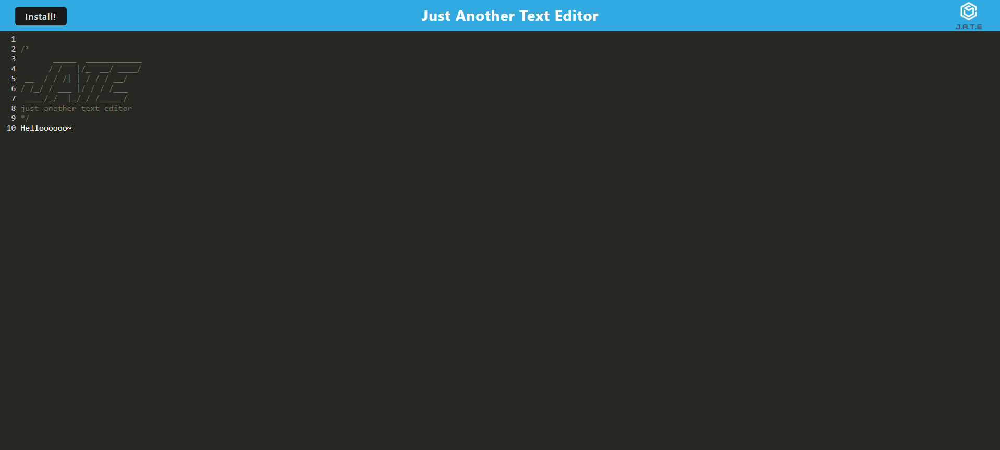

# Text Editor

[](https://opensource.org/licenses/MIT)


## Description

This project is a simple text editor that is downloadable as a progressive web application. Built using Node, Express, Webpack, and Workbox, and hosted on Render, this application uses service workers to pre-cache assets, allowing it to function offline. It stores and retrieves the text inputted in IndexedDB, allowing it to preserve what users have written, even after closing the window.

## Table of Contents

- [Installation](#installation)
- [Usage](#usage)
- [Credits](#credits)
- [License](#license)

## Installation

Clone the repository:

```
git clone https://github.com/otekolste/social-media-backend.git
cd social-network-backend
```

Install dependencies:

```
npm install
```

Start the application:

```
npm start
```

Then go to localhost://PORT NUMBER in your browser (substituting PORT NUMBER for whatever port it's running on.) This program is best used in an incognito window when hosting it on your machine, as it makes use of the browser's cache to store assets!

## Usage



Go [here](https://text-editor-emug.onrender.com/) to use the application!

Type whatever you'd like - the browser will save it using IndexedDB, allowing you to close the window safely and re-open it as needed.

You can also install it by clicking the "Install!" button in the top left, allowing you to use it as a PWA. In addition, you can use this application offline!

## Credits

For the full list of packages used, check out the package.json files: [here](package.json), [here](client/package.json), and [here](server/package.json)!
Base code was provided by edX.

## License

This code is covered by the MIT license. For more information, click on the badge at the top of the profile.
